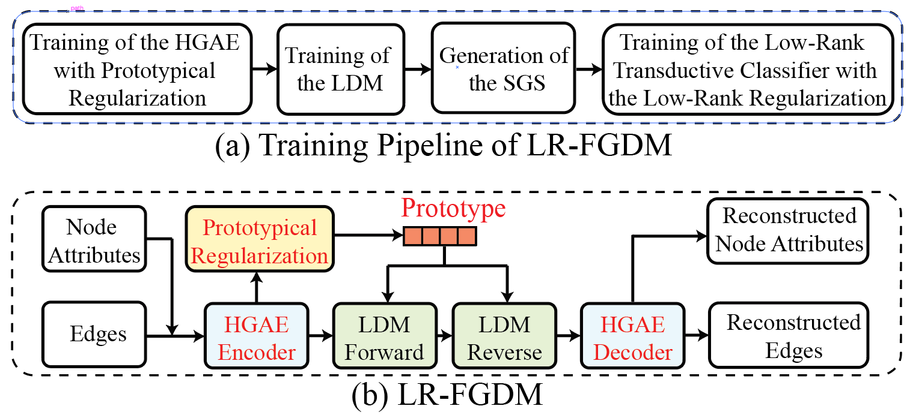

# Low-Rank Few-Shot Node Classification by Node-Level Graph Diffusion (ICLR 2026)

## Abstract 
In this paper, we propose a novel node-level graph diffusion method with low-rank feature learning for few-shot node classification (FSNC), termed Low-Rank Few-Shot Graph Diffusion Model or LR-FGDM. LR-FGDM first employs a novel Few-Shot Graph Diffusion Model (FGDM) as a node-level graph generative method to generate an augmented graph with an enlarged support set, then performs low-rank transductive classification to obtain the few-shot node classification results. Our graph diffusion model, FGDM, comprises two components, the Hierarchical Graph Autoencoder (HGAE) with an efficient hierarchical edge reconstruction method and a new prototypical regularization, and the Latent Diffusion Model (LDM). The low-rank regularization is robust to the noise inherently introduced by the diffusion model and empirically inspired by the Low Frequency Property. We also provide a strong theoretical guarantee justifying the low-rank regularization for the transductive classification in few-shot learning. To further enhance the performance of LR-FGDM, we introduce LRA-LR-FGDM with a novel efficient LR-Attention layer, or the LRA layer, which applies self-attention to the output of the LR-FGDM encoder. The LRA layer further reduces the kernel complexity of LR-FGDM and contributes to a tighter generalization bound, leading to improved performance. Extensive experimental results evidence the effectiveness of LR-FGDM for few-shot node classification, which outperforms the current state-of-the-art.



## Requirements

This project was tested with ```Python ≥ 3.9``` and ```PyTorch ≥ 2.0```.

Install the required dependencies:

```bash
pip install torch torchvision numpy tqdm ema-pytorch
```

## Demo Usage
You can run the demo command to launch train.py within ```your_dir```

```
python  train.py --batchsize 256 --modch 64 --moddir your_dir --samdir your_dir --epoch 3000 --interval 30 --intervalplot 1 --nettype unet_1d --inch 1 --outch 1 --inputsize 64 --clsnum 7 --datatype gclemb --datadir ./all_embs.npy --labeldir ./all_ps_labels.npy --genum 140 --genbatch 140  --norm 1 
```


